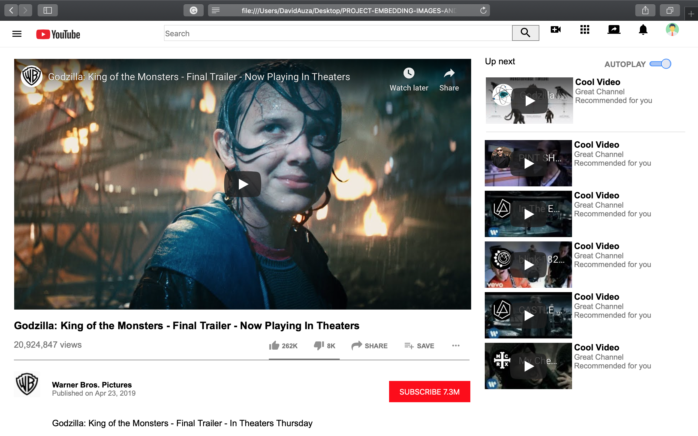
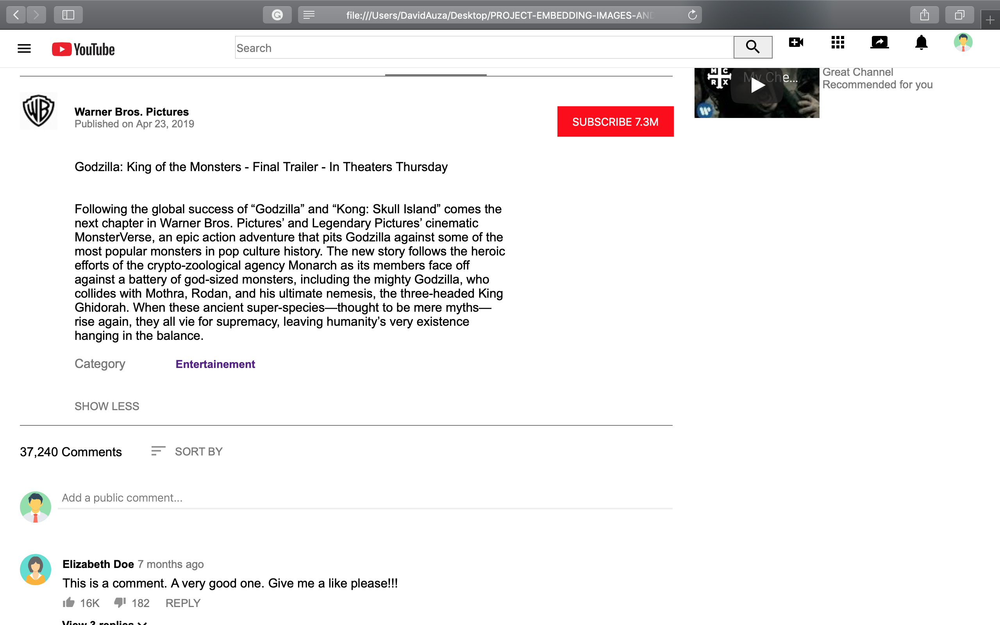
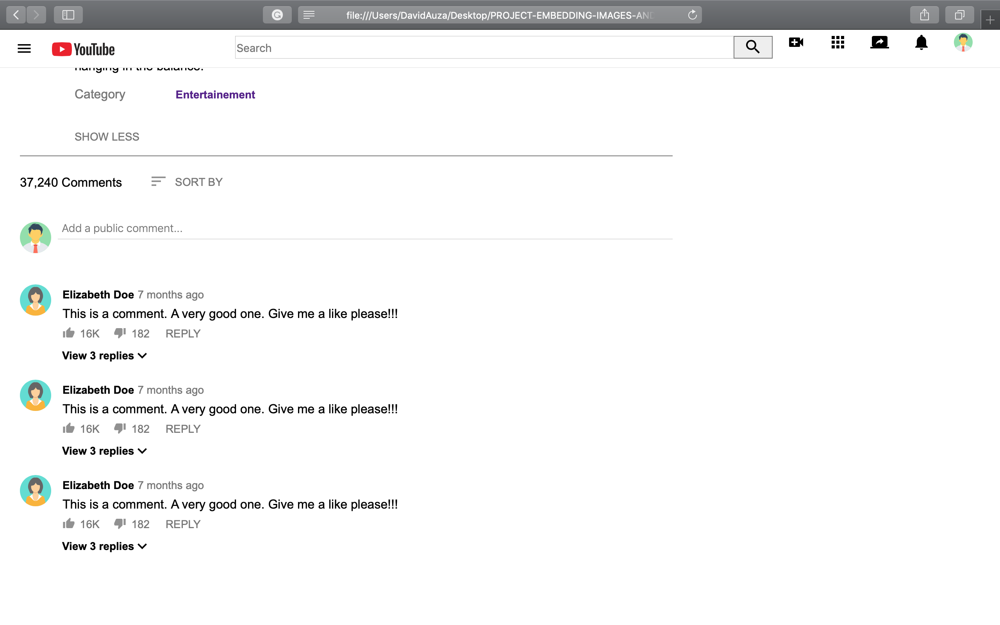

# PROJECT-EMBEDDING-IMAGES-AND-VIDEO

This is our solution to Microverse's first project. It is a YouTube video player page clone. It is created using HTML5 and CSS3.

Project contributors:

- David Auza
- Eduardo Reis

## Screenshots

### Screenshot 1

### Screenshot 2

### Screenshot 3

